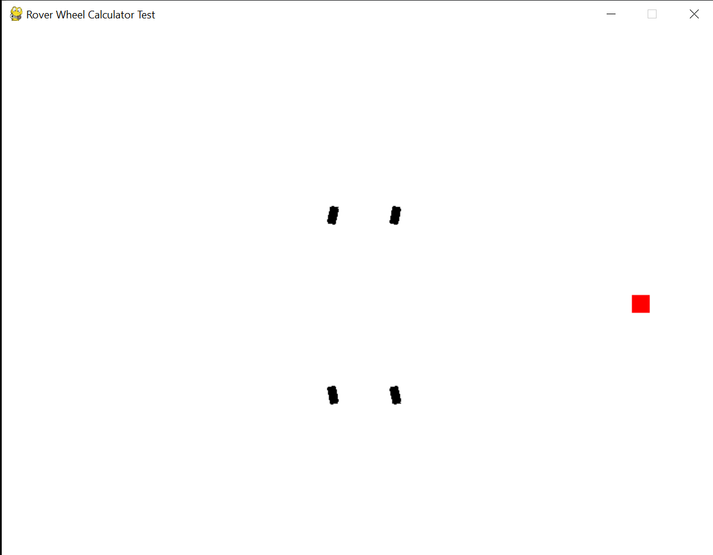
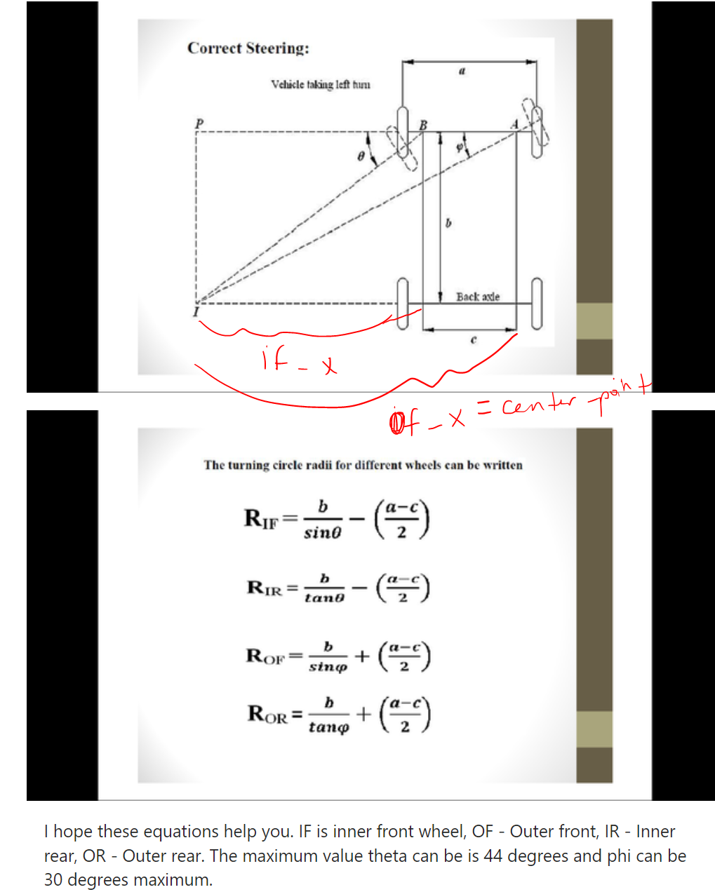
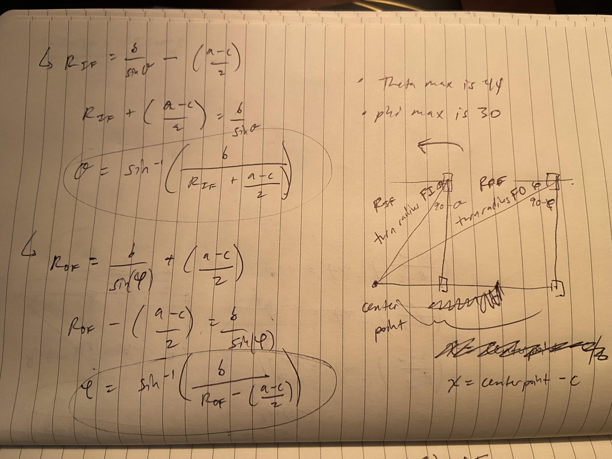
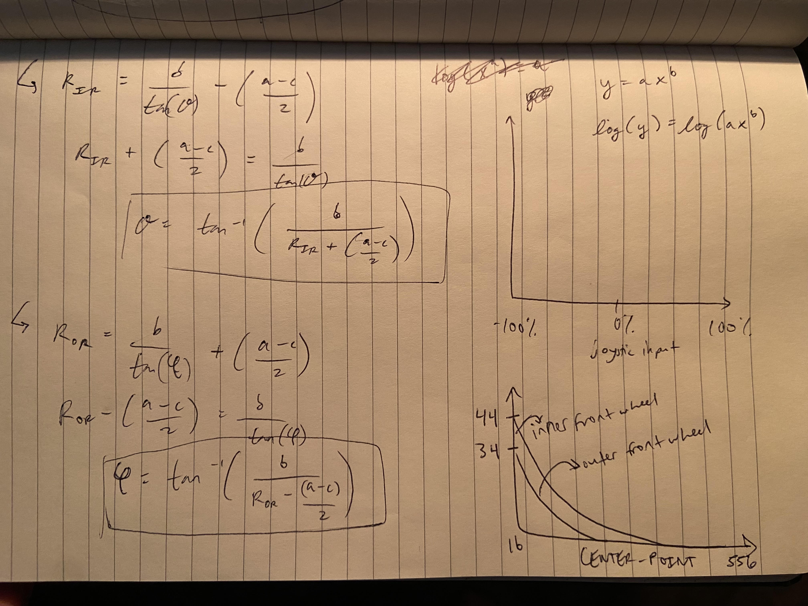
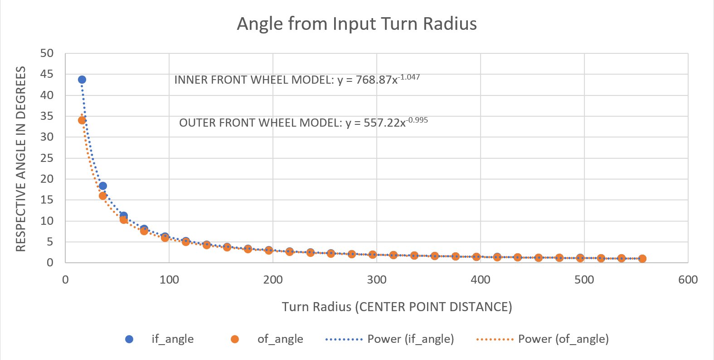
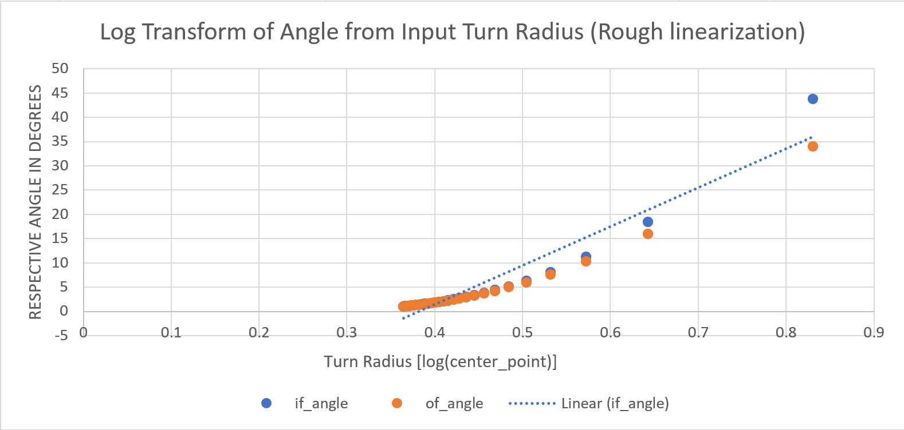

# Rover Wheel Angle Calculator
Calculate the inner and outer wheel angles to control steering a rover.

## Installation
Download Python 3.8 or greater from Python.org.

In the root folder of this project, do:

```commandline
python -m venv venv
venv/Scripts/python.exe -m pip install --upgrade pip
venv/Scripts/python.exe -m pip install -r requirements.txt
```

Run this test to make sure installation worked:
```commandline
venv/Scripts/python.exe .\tests\hello_world.py
```

## Usage
Using the `RoverWheelAngleCalculator` object (for now, only `'linear'` input scale is enabled):
```python
from rover_wheel_angle_calculator import RoverWheelAngleCalculator

# define the dimensions of the rover (distance unit doesn't matter as long as it's consistent) 
ROVER_Y = 10  # from center y length of rover to front wheels; should be the same distance as center to back
ROVER_X = 7  # full x width of rover

# define the wheel angle calculator object
wheel_angle_calculator = RoverWheelAngleCalculator(
    # define rover dimensions (dependency of turn radius and wheel angles)
    distance_between_front_wheels=9,  # 'a' in diagram. For rover, this is half of length of rover
    distance_between_front_pivots=ROVER_X,  # 'c' in diagram
    distance_between_axels=ROVER_Y,  # 'b' in diagram
    
    # by default, joystick range for all the way left is -100%, all the way right is 100%
    # You can either map joystick vals yourself from -100% to 100% or you can change this range
    # to reflect the range of values your joystick will have
    joystick_range=[-100, 100],  # [max val left, max val right]
    
    input_scale='linear'
)

# get wheel output angles in degrees from percent of the x (left/right) joystick input!
joystick_input_pct = 60  # 60% to the right from the joystick at center 0%
left_front_angle, right_front_angle, left_back_angle, right_back_angle = wheel_angle_calculator(joystick_input_pct)
```

## Example
A PyGame example system using a `'linear'` slider input is in `tests/pygame_example_ui.py`:
```commandline
venv/Scripts/python.exe .\tests\pygame_example_ui.py
```



## Wheel Angle Equations

The rover system requires a left/right input slider from the UI so that it can send output angle values to the rover wheel servo motors. The inner and outer wheels have a different turn radius and wheel angle that must be calculated. The input slider value is a relative value between -100% (left) and 100% (right) (`center_point` in the code), which then is mapped to the turn radius of inner and outer wheels, which can then be converted to wheel angle using trigonometry.

[Wheel angles diagram below taken from here](https://www.quora.com/What-is-the-method-to-calculate-turning-radius-if-only-the-steering-ratio-and-vehicles-basic-dimensions-are-known).


The equations above have turn radii in terms of wheel angle. The rover system requires the opposite; wheel angle in terms of turn radii. The following is each equation inverted for the `RoverWheelAngleCalculator` to use:

[//]: # ()
[//]: # ()

- &theta;(R<sub>IF</sub>) = sin<sup>-1</sup>(b / (R<sub>IF</sub> + (a + c)/2))
- &phi;(R<sub>OF</sub>) = sin<sup>-1</sup>(b / (R<sub>OF</sub> - (a - c)/2))
- &theta;(R<sub>IR</sub>) = tan<sup>-1</sup>(b / (R<sub>IR</sub> + (a - c)/2))
- &phi;(R<sub>OR</sub>) = tan<sup>-1</sup>(b / (R<sub>OR</sub> - (a - c)/2))

Where &theta; is the inner wheel angle and &phi; is the outer wheel angle, and "IF" refers to the "inner front" wheel and "OF" refers to the "outer front" wheel, "IR" and "OR" refer to "inner rear" and "outer rear" wheels respectively. The diagram uses turning left as the reference, and so the left front wheel in this case is the "inner front" wheel, and the right front wheel is the "outer front" wheel. Turning right, these are opposite.

All angles calculated are relative to the horizontal. The servo motor code has the angles relative to the vertical. Having the servo motor code receive angles from the `RoverWheelAngleCalculator` is fine, as the angles represent relative change; not absolute angles.

As the turn radius approaches infinity, the wheel angle approaches infinity. As the turn radius approaches 0, the wheel angle approaches 0. To solve this problem, min and max phi and theta (phi and theta definitions as they are in the diagram) defaults are defined in the `RoverWheelAngleCalculator` object initialization. The `RoverWheelAngleCalculator` uses these angle ranges and the dimensions of the rover to calculate a practical range of UI input allowed. Having a finite range of turn radii then allows the joystick input to be scaled to the practical range of radii.

Using this technique, the relationship between input turn radius and output wheel angle was plotted and fit and found to be a power curve:


Therefore, in some places, small changes to the joystick input cause large changes in wheel angle, and in other places, small changes to the joystick input cause small changes in wheel angle. This falloff effect may produce erratic changes in wheel angle which are difficult to control with a joystick. Therefore, applying a `log()` transform to the UI input to rougly linearize the curve may give a smoother user experience controlling the rover:




